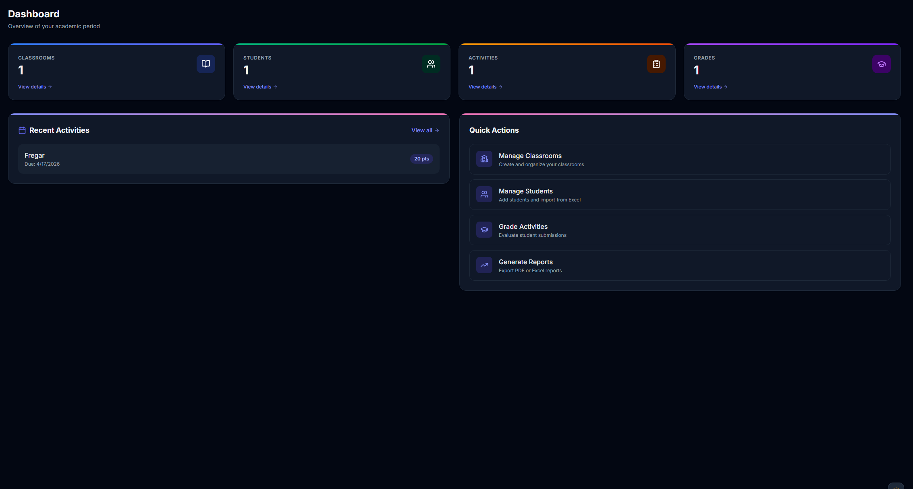
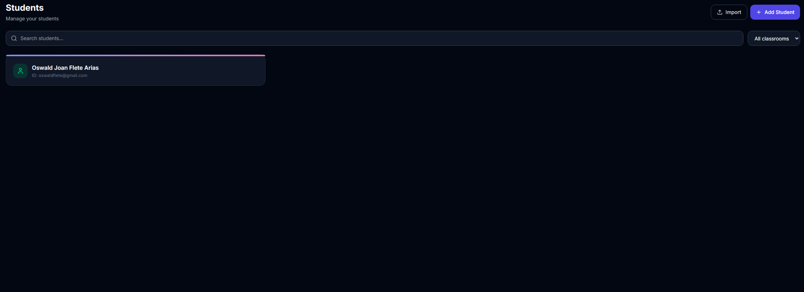
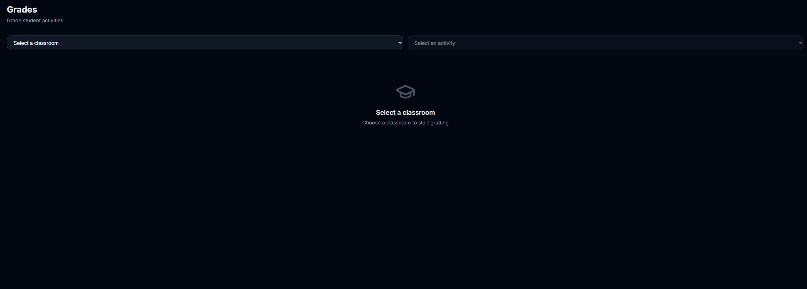
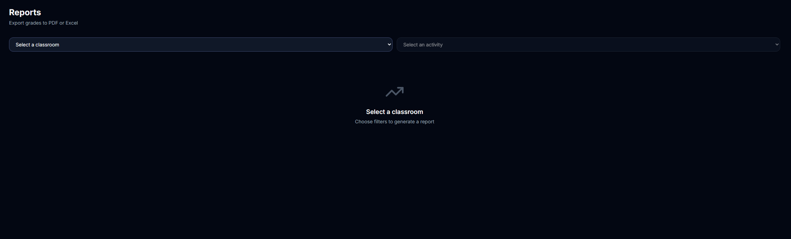

<div align="center">
  
</div>

<p align="center">
  <b>School management platform for teachers</b><br>
  <sub>Built with React 19 + Flask + PostgreSQL | Migrated from CRA/Chakra UI to Vite/Tailwind CSS v4</sub>
</p>

<br>

<div align="center">

[](https://react.dev)
[](https://vite.dev)
[](https://tailwindcss.com)
[](https://flask.palletsprojects.com)
[](https://www.postgresql.org)
[](https://clerk.com)

</div>

<br>

---

## 📋 Table of Contents

- [About the Project](#-about-the-project)
- [Problem & Motivation](#-problem--motivation)
- [Target Audience](#-target-audience)
- [Features](#-features)
- [Tech Stack](#-tech-stack)
- [Architecture](#-architecture)
- [File Structure](#-file-structure)
- [Key Design Decisions](#-key-design-decisions)
- [Screenshots](#-screenshots)
- [License](#-license)

<br>

---

## 📖 About the Project

**Aula Eficiente** ("Efficient Classroom" in Spanish) is a full-stack web application that gives teachers a centralized platform to manage their academic workflow. It replaces the traditional paper-based grade book and scattered spreadsheets with a clean, modern interface for organizing classrooms, tracking students, creating activities, recording grades, and generating reports.

The frontend is a **React 19** single-page application built with **Vite 8** and styled entirely with **Tailwind CSS v4** (migrated from Create React App + Chakra UI). The backend is a **Flask** REST API backed by **PostgreSQL 18**, with **Clerk** handling authentication. Reports can be exported as **PDF** or **Excel** files.

### Why the rebuild?

The original version used **Create React App** (CRA) with **Chakra UI**. It was rebuilt from scratch using **Vite** (dramatically faster dev server and builds) and **Tailwind CSS v4** (smaller bundles, more flexible styling, utility-first approach). The migration improved build times from ~30s to under 1s and reduced the CSS bundle significantly.

<br>

---

## 🎯 Problem & Motivation

Teachers in many schools manage their grading and classroom data using a combination of:

- **Paper grade books** — fragile, hard to back up, impossible to analyze
- **Excel spreadsheets** — disconnected, error-prone, no collaboration
- **Multiple disconnected tools** — attendance in one app, grades in another, reports in a third

**Aula Eficiente** solves this by providing a single, unified platform where a teacher can:

1. Create and organize classrooms by academic period
2. Register students individually or in bulk (Excel/CSV import)
3. Design activities and assignments with custom scoring
4. Record and update grades in a streamlined interface
5. Export professional reports in PDF or Excel format
6. Access everything from any device with a web browser

The system is designed for **individual teacher use** (not multi-institution) — it focuses on making one teacher's daily workflow as smooth as possible.

<br>

---

## 👤 Target Audience

| Role | Need |
|---|---|
| **Individual teachers** | Grade management, student tracking, report generation |
| **Tutors / private educators** | Small class management with activity tracking |
| **Student teachers** | Practice platform for learning classroom management |
| **Small academies** | Per-teacher classroom organization (each teacher manages their own) |

The system is **not** designed for:
- Large school districts (no admin panel, no cross-teacher features)
- Student portals (no parent/student login)
- Real-time collaboration (single-user focused)

<br>

---

## ✨ Features

<table align="center">
<tr>
<td align="center" width="33%">
  <h3>📊 Dashboard</h3>
  <p>At-a-glance stats, recent activities, and quick actions</p>
</td>
<td align="center" width="33%">
  <h3>👥 Student Management</h3>
  <p>Register, edit, delete students. Bulk import via Excel/CSV with drag-and-drop preview and template downloads</p>
</td>
<td align="center" width="33%">
  <h3>📚 Classrooms</h3>
  <p>Full CRUD with search and period-based filtering. Organize students into groups</p>
</td>
</tr>
<tr>
<td align="center" width="33%">
  <h3>📝 Activities</h3>
  <p>Create assignments with due dates and max scores. Filter by classroom</p>
</td>
<td align="center" width="33%">
  <h3>🏆 Grades</h3>
  <p>Enter scores per student per activity. Clean spreadsheet-like interface with auto-save</p>
</td>
<td align="center" width="33%">
  <h3>📄 Reports</h3>
  <p>Export complete grade reports as PDF (jsPDF with auto-table) or Excel (xlsx). Auto-calculated totals and averages</p>
</td>
</tr>
<tr>
<td align="center" width="33%">
  <h3>📅 Academic Periods</h3>
  <p>Create terms (e.g. "Fall 2026"). Period-scoped data keeps everything organized</p>
</td>
<td align="center" width="33%">
  <h3>🌓 Dark Mode</h3>
  <p>Light/dark toggle persisted in localStorage. Tailwind class-based dark mode with no flash</p>
</td>
<td align="center" width="33%">
  <h3>🔐 Authentication</h3>
  <p>Clerk-powered sign-in with Google/GitHub OAuth. Profile photo upload with Discord-style crop modal</p>
</td>
</tr>
</table>

<br>

---

## 🛠 Tech Stack

<div align="center">

### Frontend

| Technology | Version | Purpose |
|---|---|---|
| **React** | 19 | UI framework, hooks-based component architecture |
| **Vite** | 8 | Dev server and bundler (replaced CRA) |
| **Tailwind CSS** | 4 | Utility-first styling with `@custom-variant dark` for class-based dark mode |
| **Framer Motion** | 12 | Page transitions, layout animations, micro-interactions |
| **React Router** | 7 | Client-side routing with nested layouts |
| **Clerk React** | 5 | Authentication UI components, session management, JWT tokens |
| **lucide-react** | — | Consistent icon set |
| **jsPDF + jspdf-autotable** | — | PDF generation with auto-formatted tables |
| **xlsx** | — | Excel/CSV parsing for bulk student import |

### Backend

| Technology | Version | Purpose |
|---|---|---|
| **Flask** | 3 | REST API framework with blueprints |
| **SQLAlchemy** | 2 | ORM with relationship mapping and cascade deletes |
| **PostgreSQL** | 18 | Primary database |
| **Alembic** | — | Schema migrations |
| **Pillow** | — | Profile image validation and processing |
| **Flask-CORS** | — | Cross-origin requests from frontend (port 3000 → port 5000) |
| **python-dotenv** | — | Environment variable loading |

</div>

<br>

---

## 🏗 Architecture

The project follows a **client-server** architecture with a clear separation of concerns. The React SPA communicates with the Flask REST API over HTTP, using JWT tokens (issued by Clerk) for authentication.

```
┌──────────────────────────────────────────────────────────────┐
│                      Browser (port 3000)                      │
│  ┌─────────────────────────────────────────────────────────┐ │
│  │              React SPA (Vite + Tailwind)                 │ │
│  │  ┌─────────┐ ┌──────────┐ ┌──────────┐ ┌────────────┐  │ │
│  │  │  Pages  │ │Components│ │  Context │ │  API Client │  │ │
│  │  └────┬────┘ └────┬─────┘ └────┬─────┘ └──────┬─────┘  │ │
│  └───────┴───────────┴────────────┴───────────────┘────────┘ │
│                        │  fetch() + JWT                       │
└────────────────────────┼─────────────────────────────────────┘
                         │
┌────────────────────────┼─────────────────────────────────────┐
│           Flask REST API (port 5000)                          │
│  ┌─────────┐ ┌──────────┐ ┌──────────┐ ┌──────────────────┐ │
│  │ Routes  │ │ Middleware│ │  Models  │ │  Clerk JWT Verify │ │
│  └────┬────┘ └──────────┘ └────┬─────┘ └──────────────────┘ │
│       │                        │                              │
│       ▼                        ▼                              │
│  ┌─────────┐          ┌──────────────┐                       │
│  │ Uploads │          │  PostgreSQL  │                       │
│  │ (images)│          │   Database   │                       │
│  └─────────┘          └──────────────┘                       │
└──────────────────────────────────────────────────────────────┘
```

### Data Flow

1. **Authentication**: User signs in via Clerk (OAuth or email). Clerk provides a JWT token.
2. **API Requests**: The frontend includes the JWT in the `Authorization` header for every API call.
3. **Backend Verification**: Flask middleware extracts the JWT, verifies it with Clerk's API, looks up the teacher by email, and attaches them to `g.current_teacher`.
4. **Scoping**: All data queries are filtered by `teacher_id` — teachers only see their own data. Period-based filtering further scopes classroom → activity → grade queries.

### Database Relationships

```
Teacher (1) ──→ (many) Period
Teacher (1) ──→ (many) Classroom
Period  (1) ──→ (many) Classroom
Classroom (1) ──→ (many) Student
Classroom (1) ──→ (many) Activity
Activity  (1) ──→ (many) Grade
Student  (1) ──→ (many) Grade
```

<br>

---

## 📁 File Structure

```
Proyecto_en_flask/
├── frontend/                          # React 19 + Vite 8 SPA
│   ├── src/
│   │   ├── api.js                     # API client: useFetch hook, fetchWithToken helper
│   │   ├── App.jsx                    # Root component: routes, period selector, layout
│   │   ├── main.jsx                   # Entry: ClerkProvider, ThemeProvider, ToastProvider, Router
│   │   ├── index.css                  # Tailwind v4 imports, custom theme (indigo/pink palette)
│   │   ├── context/
│   │   │   └── ThemeContext.jsx        # Dark mode state, localStorage persistence, class toggle
│   │   ├── components/
│   │   │   ├── Layout.jsx             # Sidebar nav, mobile top bar, user menu, 3 dark toggles
│   │   │   ├── Toast.jsx              # Stacked animated toast notifications (success/error/warning)
│   │   │   └── ErrorBoundary.jsx      # Class-based error boundary with fallback UI
│   │   └── pages/
│   │       ├── Dashboard.jsx          # Stats cards, recent activities list, quick action buttons
│   │       ├── StudentsPage.jsx       # Student table + Excel/CSV bulk import modal with preview
│   │       ├── ClassroomsPage.jsx     # CRUD with inline search, period filter dropdown
│   │       ├── ActivitiesPage.jsx     # Activity CRUD, classroom selector, due date picker
│   │       ├── GradesPage.jsx         # Score entry grid: rows=students, cols=activities
│   │       ├── ReportsPage.jsx        # Grade report with PDF/Excel export buttons
│   │       ├── PeriodsPage.jsx        # Period CRUD table
│   │       └── ProfilePage.jsx        # Profile edit, photo upload, Discord-style crop modal
│   ├── .env                           # VITE_CLERK_PUBLISHABLE_KEY, VITE_API_URL
│   └── vite.config.js                 # React plugin + @tailwindcss/vite plugin
│
├── backend/
│   ├── app.py                         # Flask app factory, CORS setup, Clerk JWT middleware
│   ├── models.py                      # SQLAlchemy models: Teacher, Period, Classroom, Student, Activity, Grade
│   ├── database.py                    # SQLAlchemy engine + SessionLocal factory
│   ├── routes/
│   │   ├── teachers.py                # GET/PUT profile, POST profile image, serve uploads
│   │   ├── periods.py                 # Full CRUD with teacher ownership check
│   │   ├── classrooms.py              # CRUD with period filtering + ownership check
│   │   ├── students.py                # CRUD + bulk import, classroom_id filter
│   │   ├── activities.py              # CRUD with period filtering via classroom join
│   │   └── grades.py                  # CRUD + bulk save + report with stats
│   ├── uploads/                       # Profile photos stored here, served via Flask route
│   └── alembic/                       # Database migration scripts
│
├── .gitignore
├── .venv/                             # Python virtual environment (not tracked)
├── dashboard.png                      # Screenshot: Dashboard page
├── students.png                       # Screenshot: Students page
├── grades.png                         # Screenshot: Grades page
├── reports.png                        # Screenshot: Reports page
└── README.md                          # This file
```

<br>

---

## 🔑 Key Design Decisions

### Profile Images Stored on Backend (Not Clerk CDN)
Clerk can host profile images, but the user experienced reliability issues with Clerk's CDN URLs. Images now go through a Flask endpoint (`POST /teachers/profile/image`), are saved to `backend/uploads/`, and served via `GET /teachers/uploads/<filename>`. This gives full control over image storage and loading.

### Class-Based Dark Mode with Tailwind v4
Tailwind CSS v4 defaults `dark:` to the `prefers-color-scheme` media query. To support a manual toggle, the project adds `@custom-variant dark (&:where(.dark, .dark *))` in `index.css` and toggles the `.dark` class on `<html>` via React context. The preference is stored in `localStorage`.

### Bulk Student Import via Client-Side Parsing
The `xlsx` library runs in the browser. When a teacher drops an Excel/CSV file, it's parsed client-side, shown in a preview table, then sent to the backend as JSON. This gives instant feedback without a server round-trip for parsing.

### Migration from CRA + Chakra UI
The original app used Create React App (slow dev server, monolithic builds) and Chakra UI (large CSS bundle, opinionated components). The rewrite to Vite + Tailwind CSS v4 reduced:
- Dev server startup: ~30s → under 1s
- CSS bundle: ~120KB → ~7KB (gzipped)
- Build time: ~45s → under 1s

### Single-Teacher Architecture
The entire data model is scoped to one teacher. Every model has a `teacher_id` or joins through one. This keeps the schema simple, the queries fast, and the UI focused. If multi-teacher support were needed later, it would require adding an admin layer and sharing mechanisms, but the current design intentionally avoids that complexity.

<br>

---

## 🖼 Screenshots

<div align="center">
  <table>
    <tr>
      <td align="center"><b>📊 Dashboard</b><br>Stats cards, recent activity feed, quick actions</td>
      <td align="center"><b>👥 Students</b><br>Student list with bulk import modal</td>
    </tr>
    <tr>
      <td></td>
      <td></td>
    </tr>
    <tr>
      <td align="center"><b>🏆 Grades</b><br>Score entry per student per activity</td>
      <td align="center"><b>📄 Reports</b><br>PDF report with auto-calculated columns</td>
    </tr>
    <tr>
      <td></td>
      <td></td>
    </tr>
  </table>
</div>

<br>

---

## 📄 License

Distributed under the MIT License. See `LICENSE` for more information.

<br>

---

<div align="center">

**Built with ❤️ by [Oswald Flete](https://github.com/oswaldhz)**

[](https://github.com/oswaldhz/aula-eficiente)
[](https://github.com/oswaldhz/aula-eficiente)

</div>

<br>

<div align="center">
  
</div>
